<h1 align="center"> Week 7: Azure Data Factory - Truncate and Load Pipeline Assignment</h1>

<h2>Assignment Overview</h2>

This assignment focuses on building a complete Truncate and Load ETL Pipeline using Azure Data Factory (ADF) to process multiple file types from Azure Data Lake Storage Gen2 and load them into Azure SQL Database. The pipeline implements file metadata extraction, data transformations, and automated daily processing.

<h2>Learning Objectives</h2>

By completing this assignment, I have learned:

<ul>
    <li>Master Azure Data Factory components and architecture</li>
    <li>Implement Data Flow transformations for complex data processing</li>
    <li>Learn file processing patterns with dynamic metadata extraction.</li>
    <li>Build robust ETL pipelines with error handling.</li>
    <li>Set up automated scheduling and monitoring for daily data loads.</li>
    <li>Understand truncate and load patterns vs incremental loading.</li>
<ul>

<h3>Architecture Overview</h3>

1. Azure Data Lake Storage Gen2 (Source)

       ↓

2. Azure Data Factory Pipeline

        ↓

3. Data Flows (Transformations)

       ↓
4. Azure SQL Database (Destination)

<h3>Key Components:</h3>
<ul>
    <li><b>Source: </b>CSV files in Data Lake Storage Gen2.</li>
    <li><b>Processing: </b>ADF Data Flows with derived columns for metadata extraction.</li>
    <li><b>Destination: </b>SQL Database tables with truncate and load pattern.</li>
    <li><b>Scheduling: </b> Daily trigger for automated processing.</li>
</ul>

<h3>Sample Data Files:</h3>

- [CUST_MSTR](./Data/raw/CUST_MSTR)
- [master_child_export](./Data/raw/master_child_export)
- [H_ECOM_ORDER](./Data/raw/H_ECOM_ORDER)

<h3>Phase 1: Azure Resource Group : rg-adf-assignment-week7</h3>

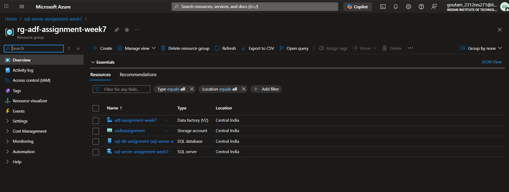

<h3>Phase 2: SQL Database : adf-assignment-week7</h3>

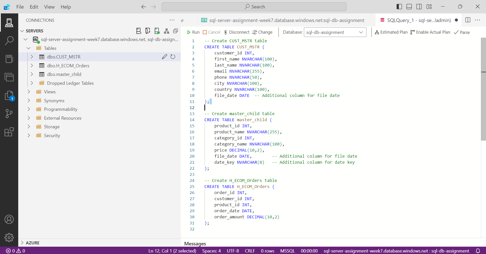
<h3>Phase 3: Data Lake Storage Gen2</h3>

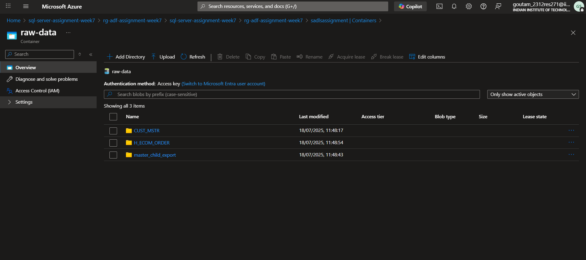

<h3>Phase 4: SQL Database Schema</h3>

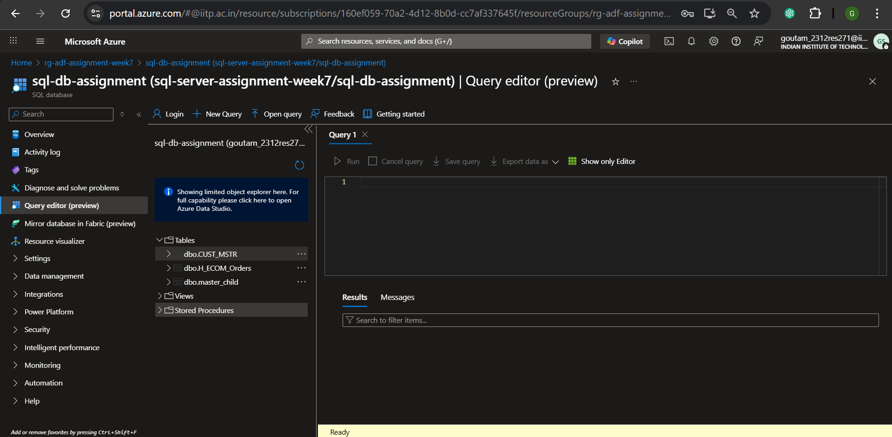

<h3>Phase 5: Azure Data Factory Pipeline Architecture</h3>

### Dynamic File Processing

1. Metadata Activities: Automatically discover files in directories
2. ForEach Loops: Process multiple files dynamically
3. Wildcard Patterns: Handle files with varying names

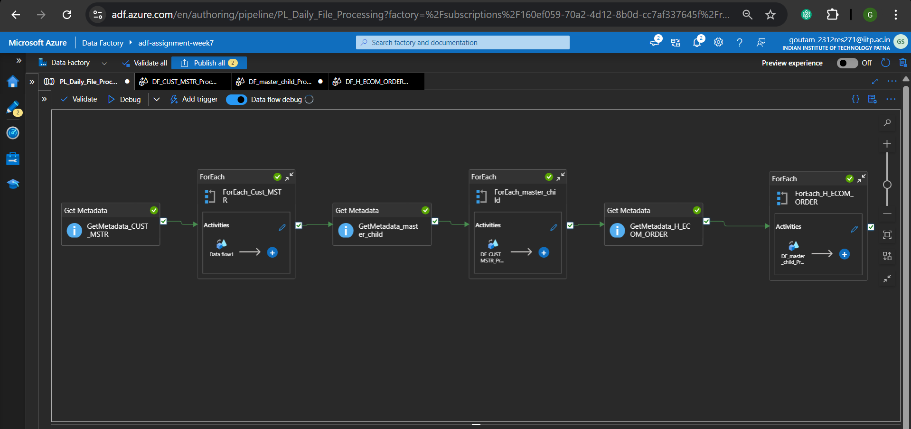

<h4>Phase 5.1: Linked Services</h4>

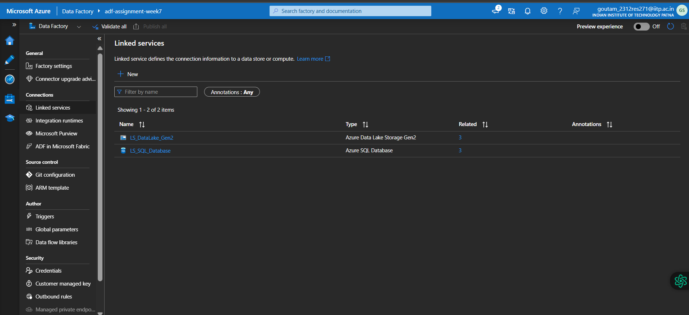

<h4>Phase 5.2: Data Flows</h4>

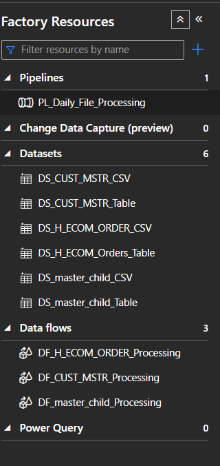

### file_date expression and add column

file_date =
toDate(
  replace(
    split(
      split(file_date, '/')[3], 
      '_'
    )[2], 
    '.csv', 
    ''
  ), 
  'yyyyMMdd'
)

<h5>Phase 5.2.1: DF_CUST_MSTR_Processing</h5>

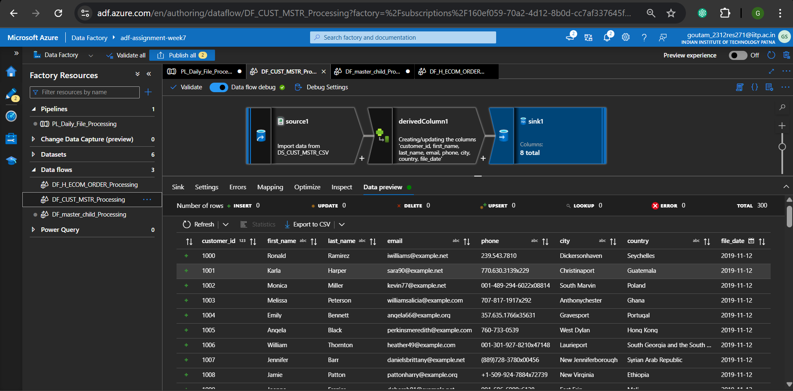

<h5>Phase 5.2.2: DF_master_child_Processing</h5>

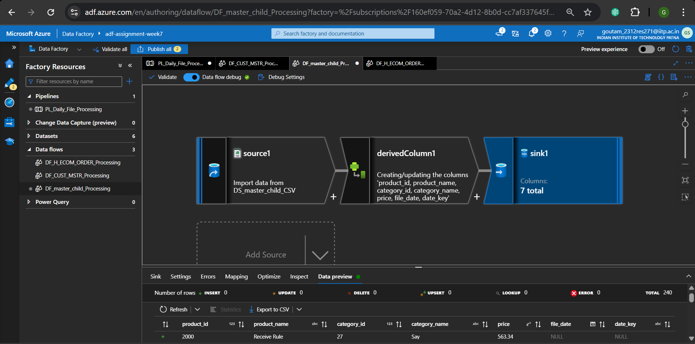

### date_key expression and add column

date_key = replace(split(split(byName('date_key'), '/')[3],'-')[2],'.csv','')

<h5>Phase 5.2.3: DF_H_ECOM_ORDER_Processing</h5>

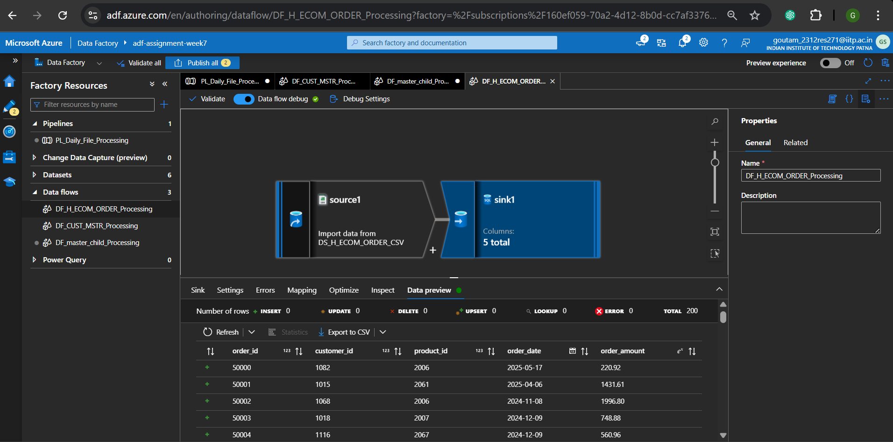

### Truncate and Load Pattern

1. Table Action: Truncate table before each load
2. Benefit: Ensures data consistency and handles schema changes
3. Use Case: Perfect for daily full refreshes
<h3>Phase 6: Triggers</h3>

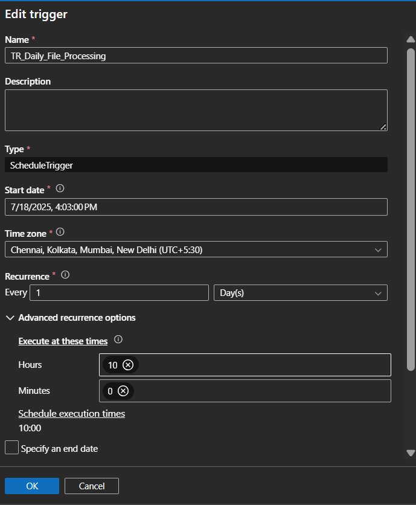

<h3>Phase 7: Pipeline Testing</h3>

<h3>Phase 8: Pipeline Monitoring</h3>

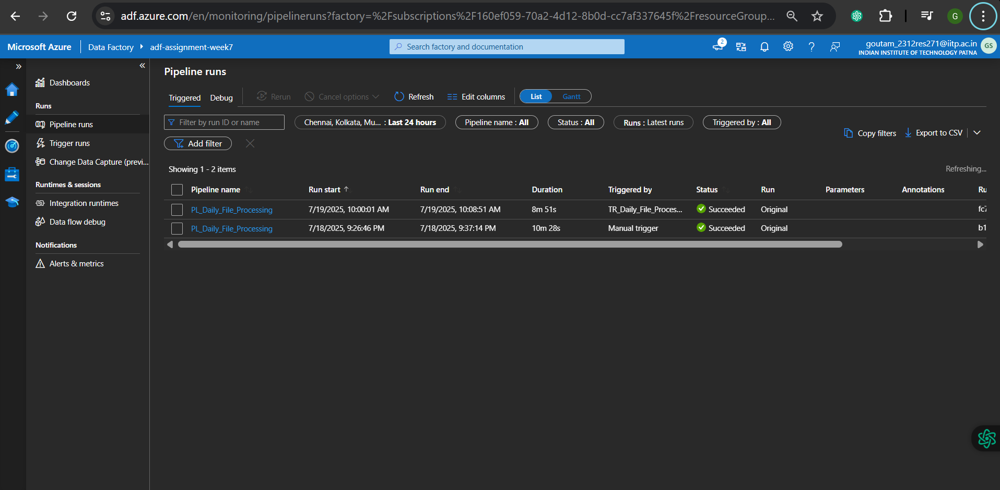

## Summary

This assignment demonstrates the end-to-end implementation of a Truncate and Load ETL pipeline using Azure Data Factory. The project covers data ingestion from Azure Data Lake Storage Gen2, dynamic file processing, metadata extraction, transformation, and loading into Azure SQL Database. Automated scheduling, error handling, and monitoring ensure robust daily data operations. The provided architecture, sample data, and step-by-step phases showcase practical skills in building scalable data engineering solutions on Azure.

---

🙏 **Acknowledgment:**  
Special thanks to CSI (Celebal Technologies) for this valuable learning opportunity during my internship.

### Prepared by: Goutam Kumar Sah